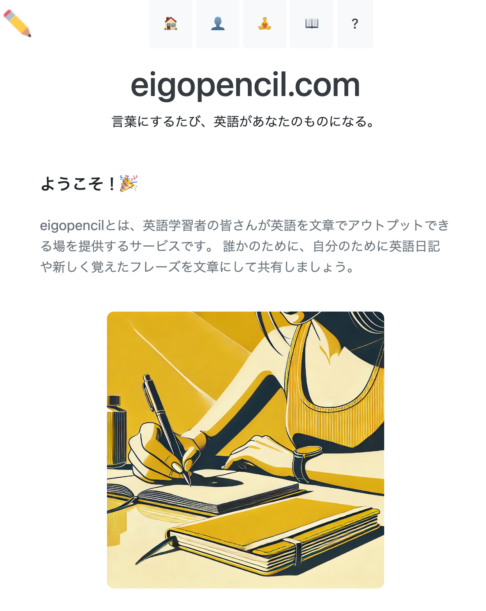
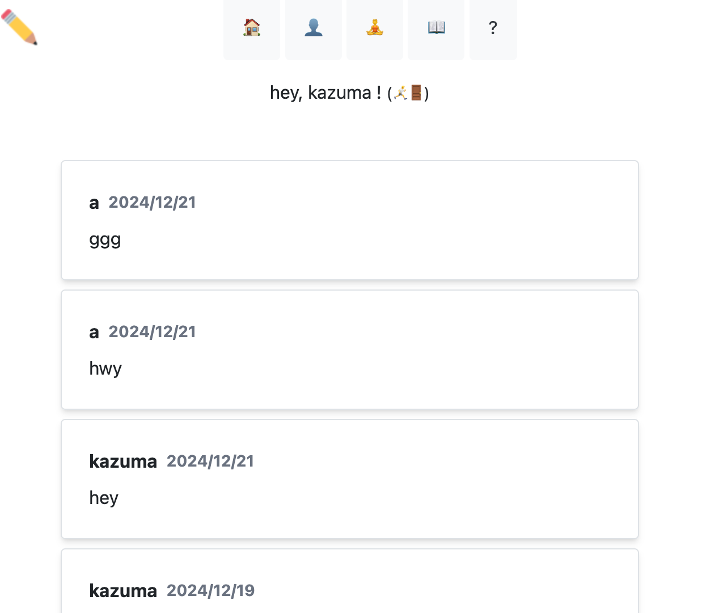
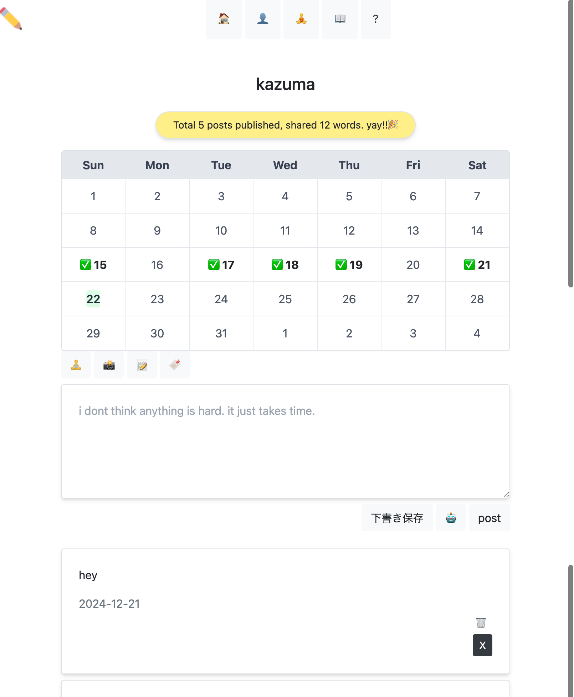
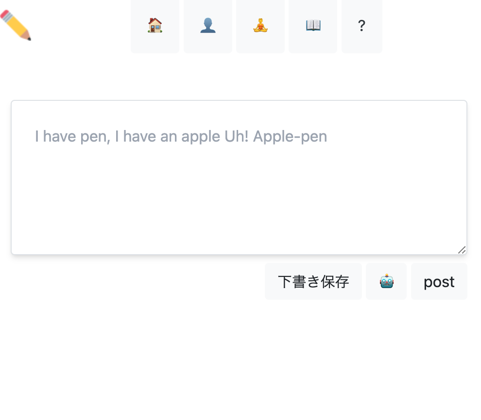
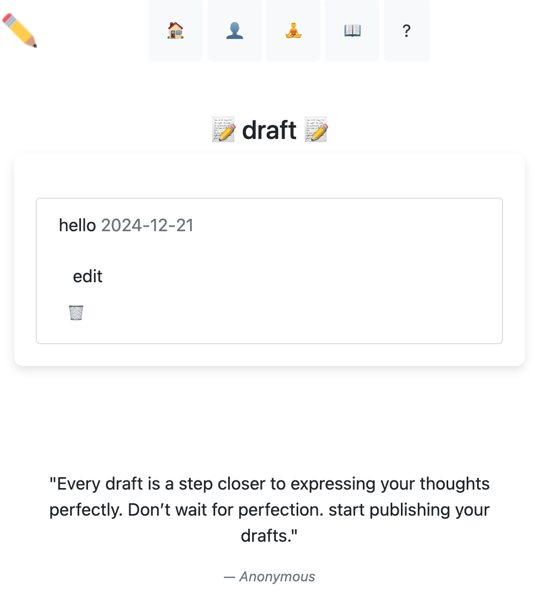
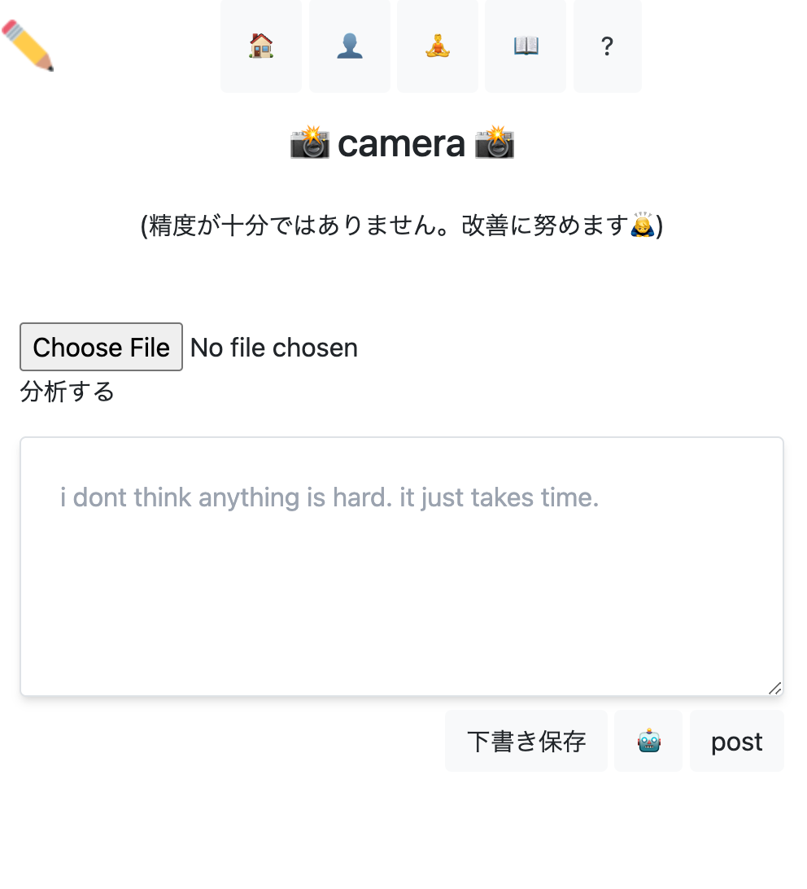

# eigopencil.com 

# 概要
<a href="https://eigopencil.com" tag_blank>eigopencil.com</a>とは、英語学習者の皆さんが英語を文章でアウトプットできる場を提供するサービスです。 誰かのために、自分のために英語日記や新しく覚えたフレーズを文章にして共有することができます。カレンダー機能でユーザーの投稿頻度や、投稿文字数を見ることができます。

# 開発背景
英語を勉強している中で、ネット上にアウトプットの場が少ないと感じていました。日記やフレーズを手軽に書き留め、それを共有できるプラットフォームがあれば、自分がモチベーションを維持しやすくなるのではないかと考え、このサービスを開発しました。

# 開発に使用した技術

フロントエンド: HTML/CSS/Bootstrap/Tailwind CSS 
バックエンド: Ruby on Rails 
データベース: PostgreSQL 
インフラ: Docker 
デプロイに使用したソフトウェア: Render(free planなので、起動時に1分ほど時間がかかります。)

# 機能一覧
- CRUD機能

- 下書き保存 (投稿を一時的に保存し、後から編集・公開可能)
-  zen mode (集中できるシンプルな執筆画面を提供)
-  投稿日をカレンダーで確認 (投稿履歴をカレンダーで確認し、投稿日を✅で表示)
- xシェア機能 (作成した投稿をワンクリックでXに共有)
- 手書き認識機能 (手書きの文字を画像から認識し、テキスト化 (rtesseract / MiniMagick 使用))

# これから実装する機能
- AI添削
- stripeを実装

# こだわったところ
- **フレンドリーなURL**:
  - 通常のルート: `eigopencil.com/user.name/:id`
  - フレンドリーURL: `eigopencil.com/user.name`
  - `friendly_id` gem を活用して、見やすく親しみやすいURLにカスタマイズしました。
- **直感的なUI/UX**:
  - Zenモードを実装し、不要な情報を削除して執筆に集中できる環境を構築。
- **画像処理の工夫**:
  - MiniMagick を用いて手書き画像の補正を行い、手書き認識率を向上。

# 各ページ

## homeページ

## userページ

## user/zenページ

## user/draftページ

## /user/cameraページ(手書き認識)

